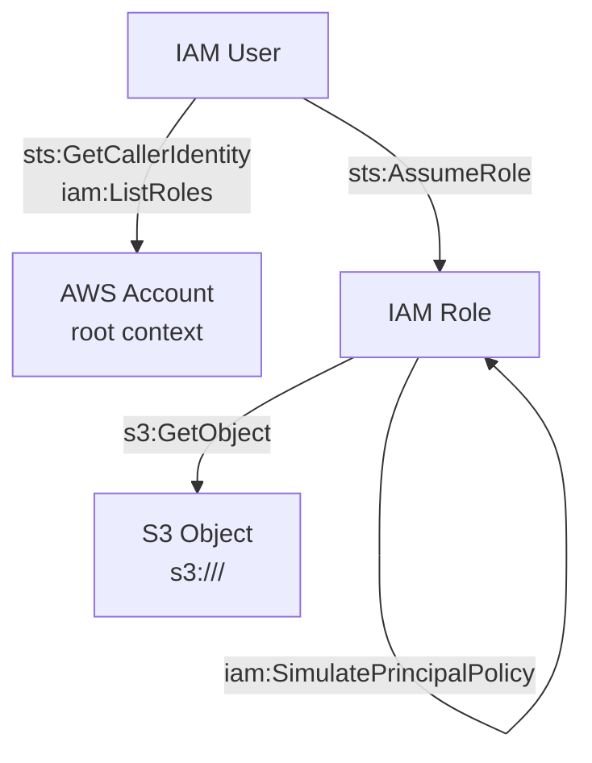

# Rastro in AWS: First Real Attack Path PoC

Este documento registra, de forma sanitizada, a primeira execução bem-sucedida
de um caminho AWS real no Rastro.

O ponto central desta prova de conceito não é apenas listar permissões ou
apontar recursos expostos. O que foi validado aqui é o núcleo da proposta do
projeto: raciocinar sobre um caminho completo de comprometimento, executar esse
encadeamento dentro de um escopo autorizado e produzir evidência auditável do
resultado.

## Test Objective

Demonstrar um caminho AWS real, curto e auditável, que conecte:

1. descobrir a identidade atual
2. enumerar roles
3. assumir uma role autorizada
4. validar permissões efetivas
5. acessar um objeto S3 alvo

## Scope and Safety Boundaries

- `target=aws`
- `dry_run=false`
- conta autorizada
- serviços permitidos:
  - `iam`
  - `sts`
  - `s3`
- região permitida:
  - `us-east-1`

Todos os identificadores abaixo foram sanitizados.

## Why This Test Matters

Até aqui, o Rastro já tinha validado:

- loop principal
- enforcement de escopo
- audit trail
- execução dry-run com semântica AWS

O passo novo desta PoC foi provar que a mesma arquitetura consegue sair da
simulação local e executar um caminho real em AWS sem abandonar os controles de
segurança do projeto.

Na prática, isso valida quatro pontos:

1. o agente consegue operar com APIs reais, não apenas fixtures
2. o caminho continua auditável passo a passo
3. o escopo continua aplicado antes da execução
4. os artefatos produzidos podem ser sanitizados para compartilhamento seguro

## Executed Path

1. `sts:GetCallerIdentity`
2. `iam:ListRoles`
3. `sts:AssumeRole`
4. `iam:SimulatePrincipalPolicy`
5. `s3:GetObject`

## Outcome

- `objective_met: true`
- `execution_mode: real`
- `real_api_called: true`
- total de passos: `3`

## Executive Summary

- Initial identity: `<REDACTED_USER>`
- Assumed role: `<REDACTED_ROLE>`
- Final resource: `s3://<REDACTED_BUCKET>/<REDACTED_OBJECT_KEY>`
- Execution mode: `real`
- Proof: `s3:GetObject` permitido e executado com sucesso

## Attack Path Graph

Esse grafo mostra o encadeamento real validado no teste:

1. o principal inicial resolve a própria identidade e enumera roles
2. o principal assume uma role autorizada
3. a role assumida confirma permissão efetiva sobre o alvo
4. a role acessa o objeto S3 final

## Step-by-Step Execution

### Step 1 — Discovery

- APIs:
  - `sts:GetCallerIdentity`
  - `iam:ListRoles`
- Resultado:
  - identidade atual resolvida
  - roles enumeradas com sucesso

### Step 2 — Privilege Escalation

- APIs:
  - `sts:AssumeRole`
  - `iam:SimulatePrincipalPolicy`
- Resultado:
  - role assumida com sucesso
  - permissão efetiva para `s3:GetObject` avaliada como `allowed`

### Step 3 — Collection

- API:
  - `s3:GetObject`
- Resultado:
  - objeto acessado com sucesso
  - preview do conteúdo foi capturado localmente e redigido nos artefatos sanitizados

## What This Validated

Esta execução demonstrou, em ambiente AWS real e autorizado:

- resolução da identidade efetiva em uso
- enumeração real de roles na conta
- assunção real de uma role alvo
- validação real de permissão efetiva antes do acesso final
- acesso real ao recurso objetivo
- produção de trilha de auditoria por step

Isso aproxima o Rastro de um agente que raciocina sobre caminhos de
comprometimento, em vez de apenas devolver uma lista estática de findings.

## Generated Artifacts

Durante runs reais, o Rastro gera:

- `report.json`
- `report.md`
- `audit.jsonl`

e também versões sanitizadas:

- `report.sanitized.json`
- `report.sanitized.md`
- `audit.sanitized.jsonl`

Esses artefatos sanitizados são os que devem ser usados para:

- posts técnicos
- demonstrações públicas
- provas de conceito compartilháveis

## Security Considerations

Esta PoC foi executada com:

- conta autorizada
- escopo explícito
- regiões e serviços permitidos
- recursos permitidos
- gate de execução real habilitado explicitamente

Além disso, os artefatos gerados pelo run incluem versões sanitizadas para
evitar exposição de:

- account ids
- ARNs reais
- nomes de usuário e role
- bucket e object key
- preview do conteúdo acessado

## Validation Checklist

- gate de execução real por `RASTRO_ENABLE_AWS_REAL=1`
- enforcement de escopo antes da execução
- execução real via SDK AWS
- audit trail por step
- geração de evidência real no report
- sanitização automática de artefatos sensíveis

## Current Limits

Esta PoC ainda representa o primeiro corte de execução real. O caminho validado
é curto, controlado e parcialmente conhecido de antemão.

Isso significa que ainda não foi validado, nesta etapa:

- escolha dinâmica da role a partir das roles descobertas
- descoberta dinâmica do recurso final
- competição entre múltiplos caminhos possíveis
- decisão autônoma entre caminhos concorrentes
- cobertura mais ampla de superfícies AWS

## Next Steps

Depois deste marco, a direção correta é ampliar a cobertura AWS sem sair ainda
desse domínio. O próximo salto de valor está em validar novos attack paths
reais, mantendo a mesma disciplina de escopo, auditoria e sanitização.

Os próximos objetivos naturais são:

- múltiplos attack paths reais em AWS
- seleção dinâmica de roles e alvos
- novos objetivos finais além de um único objeto S3
- maior autonomia do planner entre caminhos concorrentes
