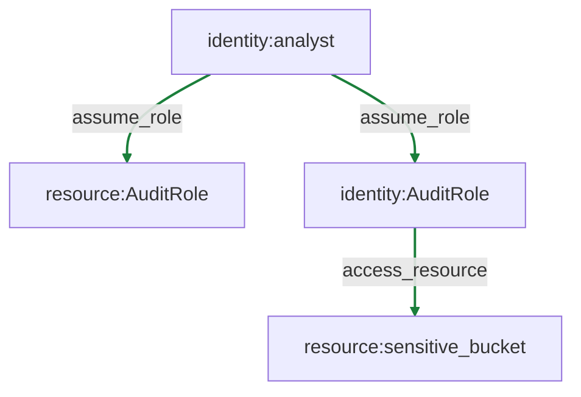

# MVP Report

Objective: Demonstrate synthetic IAM privilege escalation path to sensitive bucket.

## Starting Conditions
```
{'flags': [], 'identities': {'analyst': {'available_actions': [{'action_type': 'enumerate', 'target': 'account', 'parameters': {'note': 'list_roles'}}, {'action_type': 'assume_role', 'target': 'AuditRole', 'parameters': {'note': 'attempt_role_assumption'}}]}}}
```

## Steps Taken
Total steps: 2

## Allowed Actions
```
[{'action_type': <ActionType.ASSUME_ROLE: 'assume_role'>, 'actor': 'analyst', 'target': 'AuditRole', 'parameters': {'note': 'attempt_role_assumption'}}, {'action_type': <ActionType.ACCESS_RESOURCE: 'access_resource'>, 'actor': 'AuditRole', 'target': 'sensitive_bucket', 'parameters': {'note': 'read_sensitive'}}]
```

## Blocked Actions
```
[]
```

## Observations
```
[{'success': True, 'details': {'granted_role': 'AuditRole', 'details': 'AssumeRole succeeded.'}}, {'success': True, 'details': {'details': 'Sensitive bucket accessed.'}}]
```

## Graph Summary
- Nodes: 4
- Edges: 3

## Attack Graph (Mermaid)


## Outcome
Objective met: True
