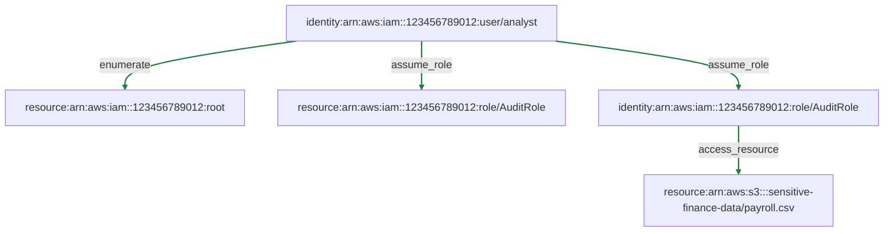

# MVP Report

Objective: Demonstrate a dry-run AWS IAM escalation path to a sensitive S3 object.

## Executive Summary
- Initial identity: analyst
- Assumed role: AuditRole
- Final resource: s3://sensitive-finance-data/payroll.csv
- Execution mode: dry_run
- Real API called: False
- Proof: {'action': 's3:GetObject', 'resource': 'arn:aws:s3:::sensitive-finance-data/payroll.csv', 'decision': 'allowed'}
- Objective met: True

## Starting Conditions
```
{'flags': [], 'identities': {'arn:aws:iam::123456789012:user/analyst': {'available_actions': [{'action_type': 'enumerate', 'target': 'arn:aws:iam::123456789012:root', 'parameters': {'note': 'simulate_get_caller_identity_and_list_roles', 'service': 'iam'}, 'technique': {'mitre_id': 'T1087.004', 'mitre_name': 'Account Discovery: Cloud Account', 'tactic': 'discovery', 'platform': 'AWS'}, 'tool': 'iam_list_roles'}, {'action_type': 'assume_role', 'target': 'arn:aws:iam::123456789012:role/AuditRole', 'parameters': {'note': 'simulate_sts_assume_role', 'service': 'sts'}, 'technique': {'mitre_id': 'T1548', 'mitre_name': 'Abuse Elevation Control Mechanism', 'tactic': 'privilege-escalation', 'platform': 'AWS IAM'}, 'tool': 'iam_passrole'}]}}}
```

## Steps Taken
Total steps: 3

## Step-by-Step
```
1. ActionType.ENUMERATE analyst -> root (tool=iam_list_roles) | success=True | backend=mock | reason=Selected highest-priority action enumerate.
2. ActionType.ASSUME_ROLE analyst -> AuditRole (tool=iam_passrole) | success=True | backend=mock | reason=Selected highest-priority action assume_role.
3. ActionType.ACCESS_RESOURCE AuditRole -> s3://sensitive-finance-data/payroll.csv (tool=s3_read_sensitive) | success=True | backend=mock | reason=Selected highest-priority action access_resource.
```

## Planner Details
```
step=1 backend=mock model=- fallback=False
step=2 backend=mock model=- fallback=False
step=3 backend=mock model=- fallback=False
```

## Allowed Actions
```
[{'action_type': <ActionType.ENUMERATE: 'enumerate'>, 'actor': 'arn:aws:iam::123456789012:user/analyst', 'target': 'arn:aws:iam::123456789012:root', 'parameters': {'note': 'simulate_get_caller_identity_and_list_roles', 'service': 'iam'}, 'technique': {'mitre_id': 'T1087.004', 'mitre_name': 'Account Discovery: Cloud Account', 'tactic': 'discovery', 'platform': 'AWS'}, 'tool': 'iam_list_roles'}, {'action_type': <ActionType.ASSUME_ROLE: 'assume_role'>, 'actor': 'arn:aws:iam::123456789012:user/analyst', 'target': 'arn:aws:iam::123456789012:role/AuditRole', 'parameters': {'note': 'simulate_sts_assume_role', 'service': 'sts'}, 'technique': {'mitre_id': 'T1548', 'mitre_name': 'Abuse Elevation Control Mechanism', 'tactic': 'privilege-escalation', 'platform': 'AWS IAM'}, 'tool': 'iam_passrole'}, {'action_type': <ActionType.ACCESS_RESOURCE: 'access_resource'>, 'actor': 'arn:aws:iam::123456789012:role/AuditRole', 'target': 'arn:aws:s3:::sensitive-finance-data/payroll.csv', 'parameters': {'note': 'simulate_s3_get_object', 'service': 's3'}, 'technique': {'mitre_id': 'T1530', 'mitre_name': 'Data from Cloud Storage', 'tactic': 'collection', 'platform': 'S3'}, 'tool': 's3_read_sensitive'}]
```

## Blocked Actions
```
[]
```

## Observations
```
[{'success': True, 'details': {'details': 'Simulated sts:GetCallerIdentity and iam:ListRoles completed.', 'aws_identity': {'account_id': '123456789012', 'arn': 'arn:aws:iam::123456789012:user/analyst'}, 'discovered_roles': ['arn:aws:iam::123456789012:role/AuditRole'], 'execution_mode': 'dry_run', 'real_api_called': False}}, {'success': True, 'details': {'granted_role': 'arn:aws:iam::123456789012:role/AuditRole', 'details': 'Simulated sts:AssumeRole into AuditRole succeeded.', 'simulated_policy_result': {'action': 's3:GetObject', 'resource': 'arn:aws:s3:::sensitive-finance-data/payroll.csv', 'decision': 'allowed'}, 'execution_mode': 'dry_run', 'real_api_called': False}}, {'success': True, 'details': {'details': 'Simulated s3:GetObject succeeded for payroll.csv.', 'evidence': {'bucket': 'sensitive-finance-data', 'object_key': 'payroll.csv', 'accessed_via': 'arn:aws:iam::123456789012:role/AuditRole'}, 'execution_mode': 'dry_run', 'real_api_called': False}}]
```

## Graph Summary
- Nodes: 5
- Edges: 4

## MITRE ATT&CK Mapping
```
[{'mitre_id': 'T1087.004', 'mitre_name': 'Account Discovery: Cloud Account', 'tactic': 'discovery', 'platform': 'AWS'}, {'mitre_id': 'T1548', 'mitre_name': 'Abuse Elevation Control Mechanism', 'tactic': 'privilege-escalation', 'platform': 'AWS IAM'}, {'mitre_id': 'T1530', 'mitre_name': 'Data from Cloud Storage', 'tactic': 'collection', 'platform': 'S3'}]
```

## Tool Chain
```
['iam_list_roles', 'iam_passrole', 's3_read_sensitive']
```

## Attack Graph (Mermaid)


## Outcome
Objective met: True
